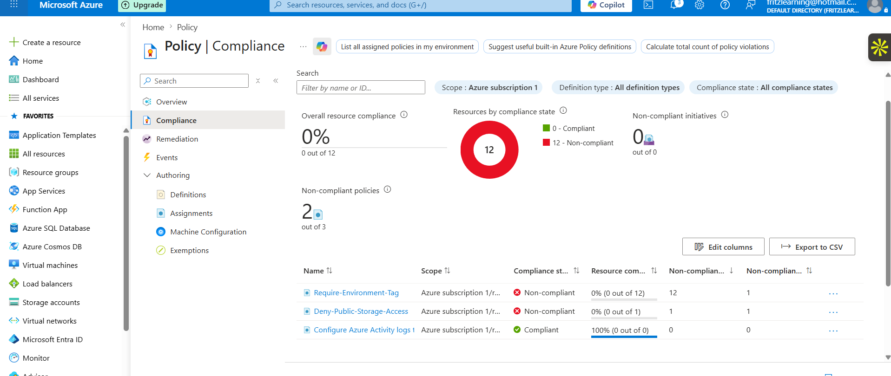
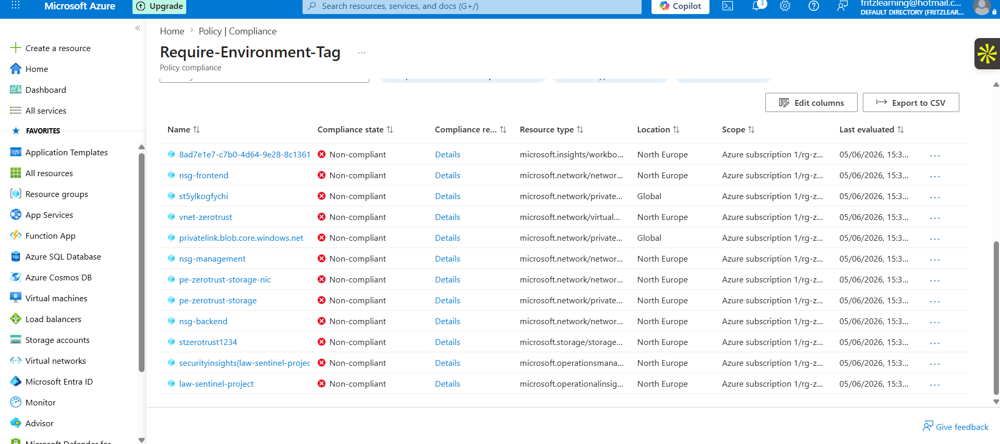
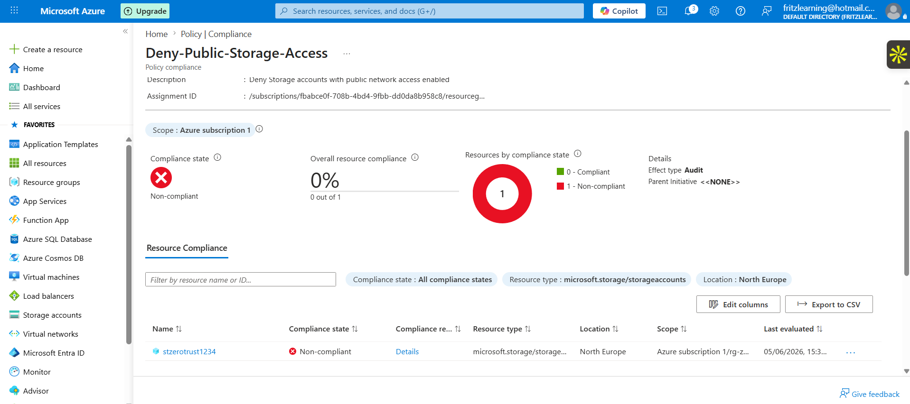
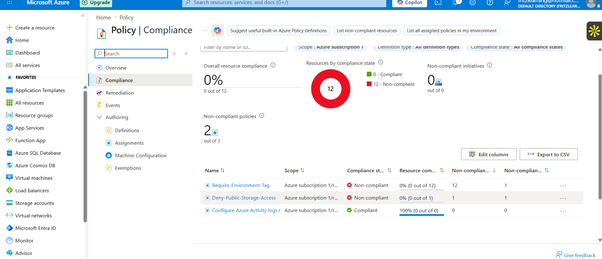
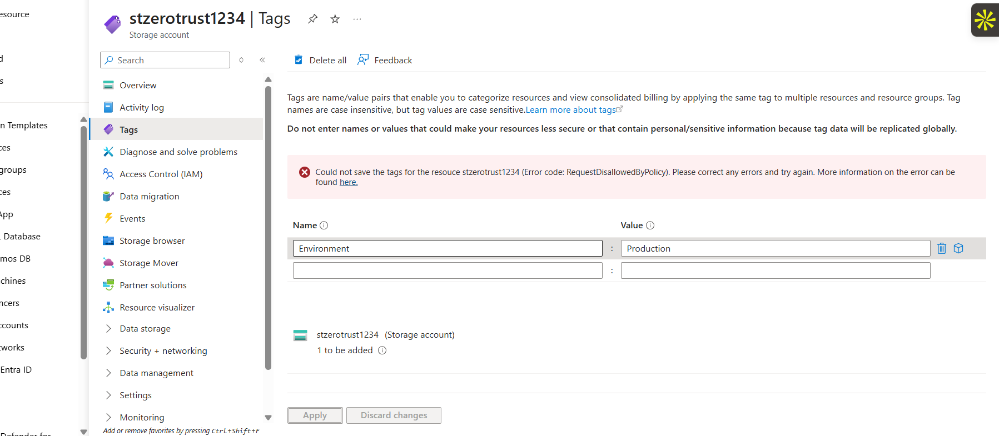
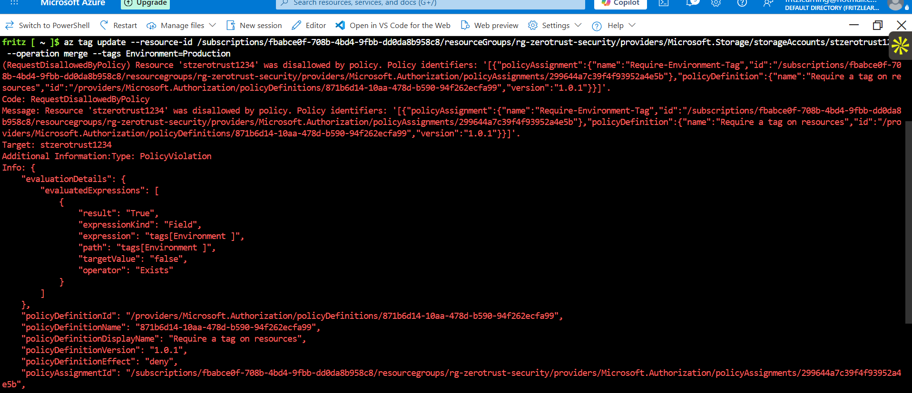
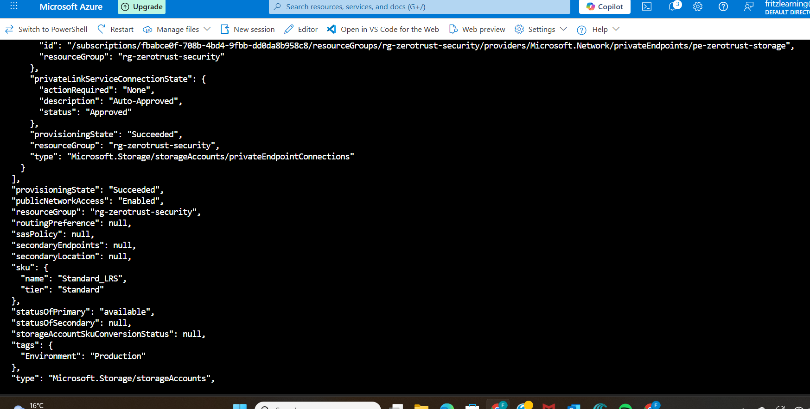
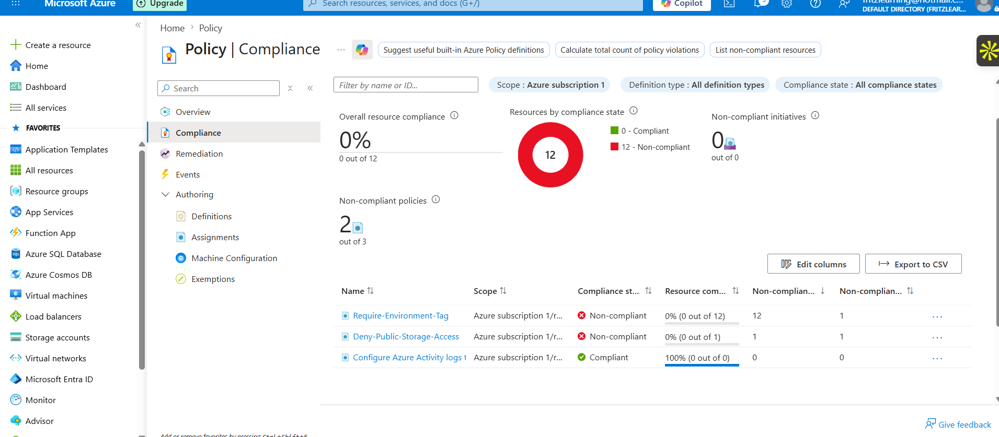
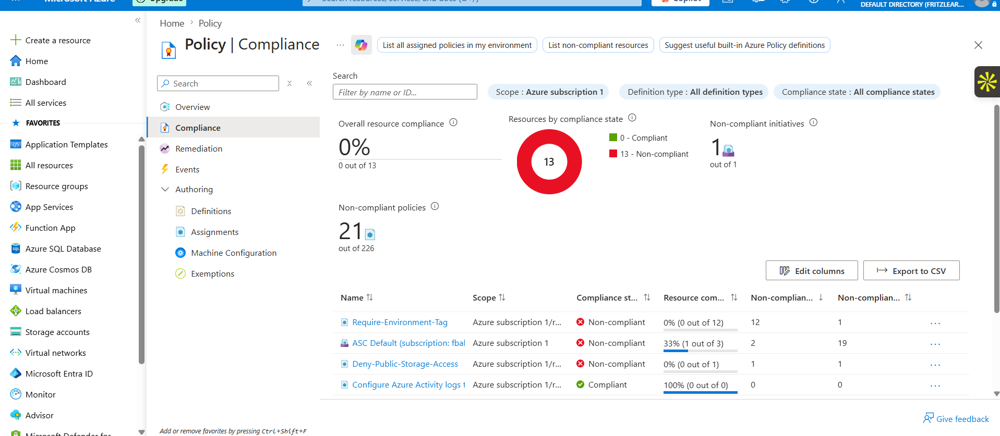
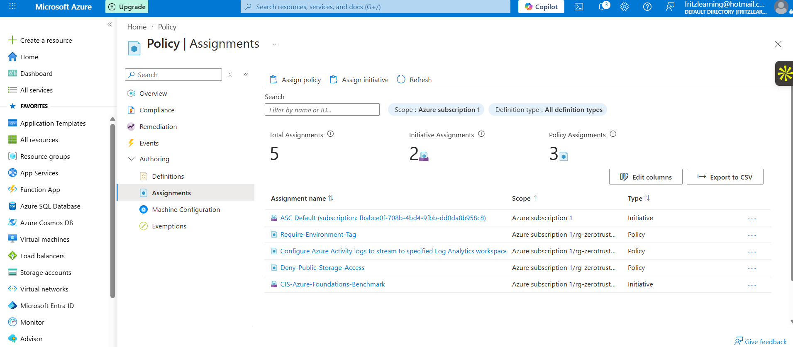

# Azure Compliance Automation with Azure Policy and Defender for Cloud

## Overview
This project implements **automated compliance governance** across an Azure environment using Azure Policy and Microsoft Defender for Cloud. Rather than manually checking whether resources are configured securely, this project demonstrates how to enforce security standards programmatically — flagging violations, blocking non-compliant configurations, and measuring posture against industry frameworks like the CIS Microsoft Azure Foundations Benchmark.

This is how real enterprises answer the question: *"Are we actually secure right now, across everything, and can we prove it?"*

## Architecture
Azure Subscription
└── rg-zerotrust-security
├── Policy Assignment: Require-Environment-Tag        (Deny)
├── Policy Assignment: Deny-Public-Storage-Access     (Deny)
├── Policy Assignment: Configure Azure Activity Logs  (DeployIfNotExists)
├── Initiative Assignment: CIS Azure Foundations v2.0 (100+ controls)
└── Initiative Assignment: ASC Default                (Defender baseline)
Microsoft Defender for Cloud
├── Foundational CSPM (enabled)
├── Secure Score
├── Recommendations
└── Regulatory Compliance Dashboard

## What I Built
- **Custom Azure Policies** enforcing tagging standards and blocking public storage access
- **CIS Microsoft Azure Foundations Benchmark v2.0** assigned as a compliance initiative
- **Compliance scan** triggered via Azure CLI to evaluate all resources in scope
- **Remediation workflow** — identified non-compliant resources and applied fixes
- **Defender for Cloud** configured with Foundational CSPM for continuous posture assessment

## Security Controls Implemented
- **Resource tagging** — Require-Environment-Tag policy (Asset inventory for incident response)
- **Public storage block** — Deny-Public-Storage-Access policy (T1530 — Data from Cloud Storage)
- **Audit logging** — Configure Activity Logs policy (T1562.006 — Indicator Removal)
- **CIS compliance** — CIS Foundations Benchmark v2.0 (100+ controls evaluated automatically)
- **Posture monitoring** — Defender for Cloud CSPM (Continuous drift detection)

## Compliance Results

### Initial Scan
- **12 non-compliant resources** identified across Projects 1–3
- Every resource built in previous projects was missing the `Environment` tag
- Storage account `stzerotrust1234` flagged for public network access policy

### Key Finding — Policy Design Issue
When attempting to remediate the tag non-compliance, the operation was blocked:
Error: RequestDisallowedByPolicy
Message: Resource 'stzerotrust1234' was disallowed by policy.
policyAssignmentDisplayName: Require-Environment-Tag
policyDefinitionEffect: deny

**Root cause:** The `Require-Environment-Tag` policy used a `Deny` effect which blocks ALL ARM operations on the resource — including adding the missing tag. This creates a deadlock where the resource cannot be made compliant without first disabling the policy.

**Enterprise lesson:** Tagging policies should use `Audit` effect during initial rollout to allow correction workflows, then switch to `Deny` after all resources are tagged.

### Remediation via CLI
Disable enforcement
az policy assignment update --name "299644a7c39f4f93952a4e5b" --resource-group rg-zerotrust-security --enforcement-mode DoNotEnforce
Apply tag
az storage account update --name stzerotrust1234 --resource-group rg-zerotrust-security --tags Environment=Production
Re-enable enforcement
az policy assignment update --name "299644a7c39f4f93952a4e5b" --resource-group rg-zerotrust-security --enforcement-mode Default
Trigger rescan
az policy state trigger-scan --resource-group rg-zerotrust-security

## Key Learnings
- **Deny vs Audit effect** — `Deny` blocks all ARM operations including remediation. Tagging policies should use `Audit` first, then `Deny` after full compliance is achieved
- **ARM intercept** — Azure Policy evaluates requests synchronously before they reach the resource provider. A blocked request returns HTTP 403 with the policy assignment details in the error body
- **Compliance scan** — Background scan runs every 24 hours automatically. Manual scans triggered via `az policy state trigger-scan`
- **CIS benchmark** — Assigning a regulatory initiative provides automatic compliance reporting against 100+ industry-standard controls
- **CSPM value** — Foundational CSPM provides continuous posture visibility at no cost

## Screenshots

### Policy Compliance Overview

### Non-Compliant Resources — Environment Tag

### Non-Compliant Resources — Public Storage

### Policy Assignments List

### Deny Policy Blocks Tag Save

### ARM-Level Policy Violation

### Tag Added via CLI

### Compliance Page Post Remediation

### Updated Compliance

### All Policy Assignments — Final State

## Technologies Used
- Microsoft Azure Policy
- Azure Resource Manager (ARM)
- Microsoft Defender for Cloud (Foundational CSPM)
- CIS Microsoft Azure Foundations Benchmark v2.0
- Azure Cloud Shell (Bash)
- Azure CLI

## Related Projects
- Project 1: [Zero Trust Network Security](https://github.com/fritzekane/azure-zerotrust-network-security)
- Project 2: [IAM Hardening with Microsoft Entra ID](https://github.com/fritzekane/azure-iam-entra-id)
- Project 3: [Security Monitoring with Microsoft Sentinel](https://github.com/fritzekane/azure-sentinel-security-monitoring)
- Project 5: Intune MDM & Endpoint Security — coming soon
- Project 6: CSPM with Defender for Cloud — coming soon
- Project 7: Fintech SaaS Security Capstone — coming soon

---
*Part of my Azure Cloud Security Portfolio — 7 hands-on projects demonstrating real-world security engineering skills.*
